# Price-of-car
Utilizing industry standard CRISP-DM, this project showcases the factors affecting the car price

## 📘 CRISP-DM Framework: Used Car Price Analysis
### 1. Business Understanding

Business Context

A used car dealership wants to better understand what factors most strongly influence the price of a used car. By identifying key features that make cars more or less expensive, the dealership can:

Make smarter inventory acquisition decisions (which cars to buy and sell)

Improve pricing strategies for used vehicles

Focus marketing efforts on features that consumers value most

This project uses historical used-car listings to analyze pricing patterns and build regression models that explain how different attributes contribute to vehicle price.

Primary Business Question

What characteristics of used cars are most strongly associated with higher prices?

Secondary Questions

Does mileage have a significant effect on price?

How much does brand or model year matter?

Do transmission type, fuel type, or number of owners affect price?

1. Data Understanding

Dataset:
A large subset (~426,000 rows) from the Kaggle Used Cars Dataset.
Each row represents a used vehicle listing.

Key Features
Feature	Description
year - Year manufactured
price -	Target variable – vehicle price 
odometer - Mileage driven
fuel -	Fuel type (Petrol, Diesel, Electric, etc.)
manufacturer - toyota, ford etc
state - registered state
vin
drive - rwd, fwd, 4wd etc
paint_color
region
type

2. Data Cleaning & Preparation
Link to Jupyter Notebook - https://github.com/sreerekha17/Price-of-car/blob/main/car-prices.ipynb

Before modeling, several cleaning and transformation steps were applied to ensure data quality and model reliability.

Cleaning Strategy Overview
Raw Data
   ↓
Dropped all empty data
   ↓
Remove invalid prices (≤ 0 or missing)
   ↓
Drop records with missing critical fields
   ↓
Checked and updated year to include range
   ↓
Removed data before 1980 and above 2025
   ↓
Separate numeric and categorical features
   ↓
Encode categorical variables

Key Cleaning Decisions

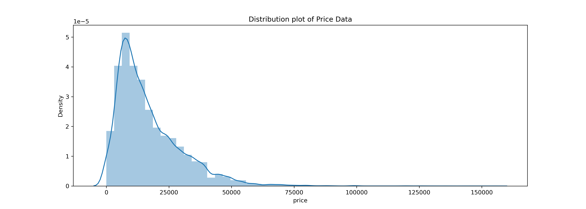

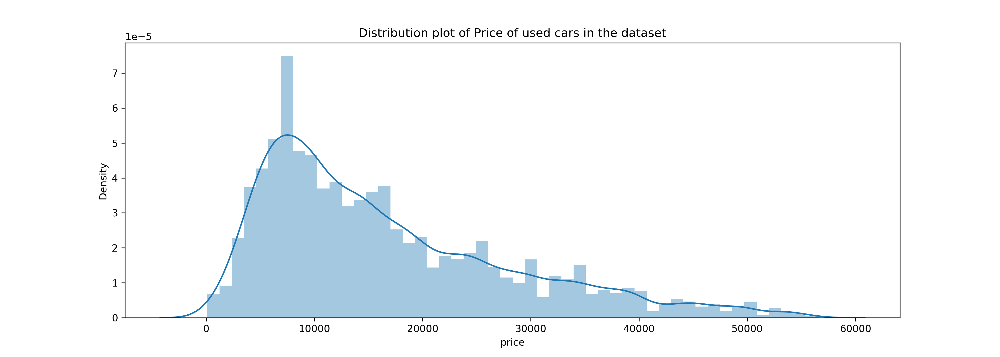

Price validation:
Removed rows with missing or non-positive prices to avoid misleading model training.

Year & mileage checks:
Ensured that year values were realistic and mileage values were non-negative.

Categorical handling:
Categorical features (drive, fuel, type, etc.) were converted to numeric to make them compatible with linear regression.

These steps reduced noise, improved interpretability, and ensured that the regression assumptions were better satisfied.

#### Price and Year Custom Range (scatter plot)

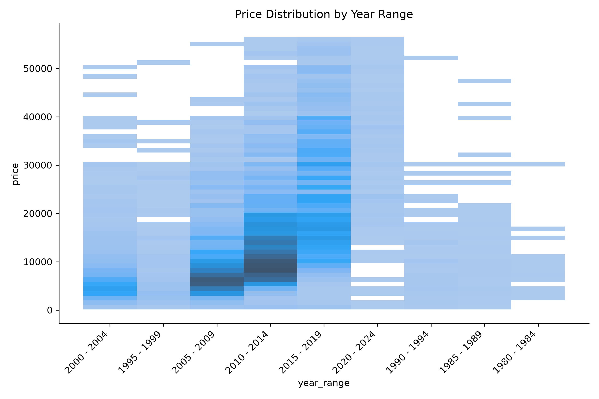

#### Price and Odometer

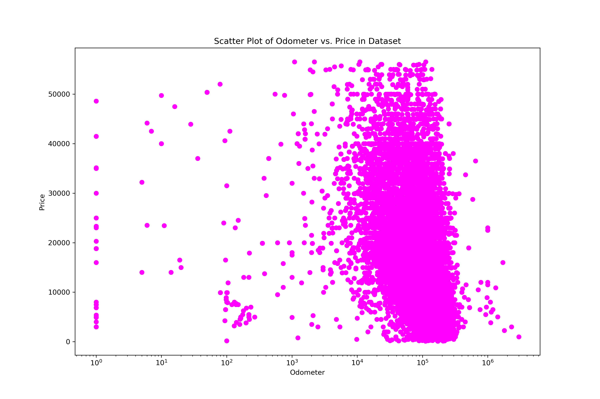

#### Price and Vehicle Year

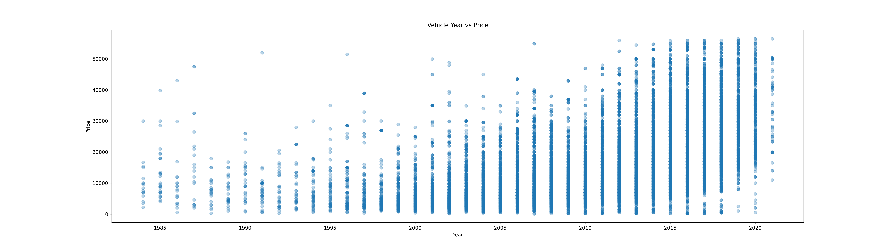

#### Price in top occurring categories

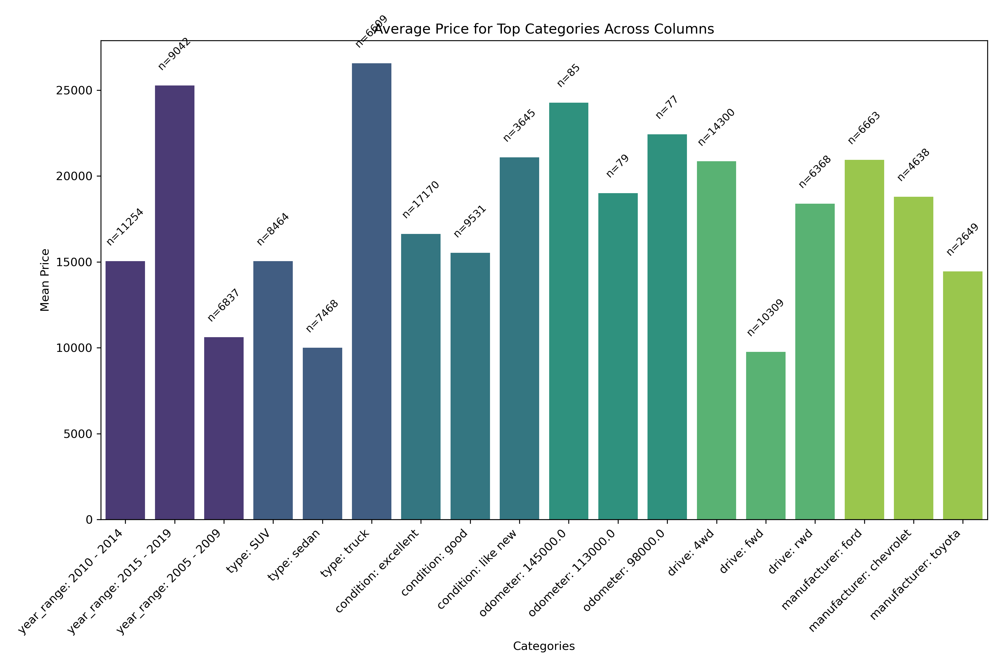

#### Pair Plot showing multiple categories

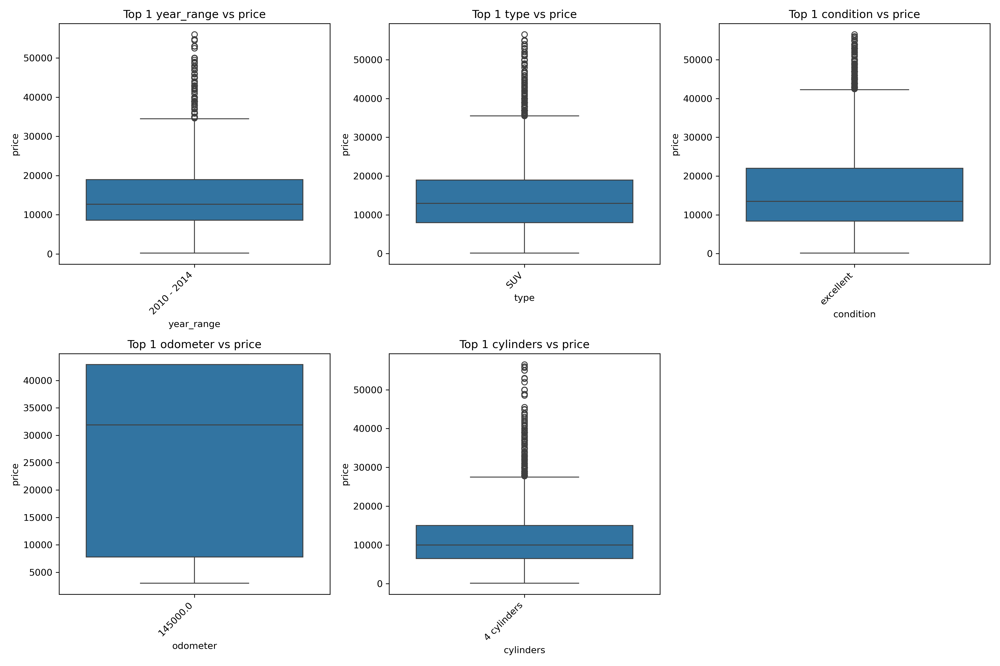

3. Exploratory Analysis (Summary)

Exploratory analysis revealed several important patterns:

Car prices are right-skewed, with many moderately priced vehicles and fewer high-priced outliers.

Newer vehicles tend to command higher prices.

Mileage shows a strong negative relationship with price.

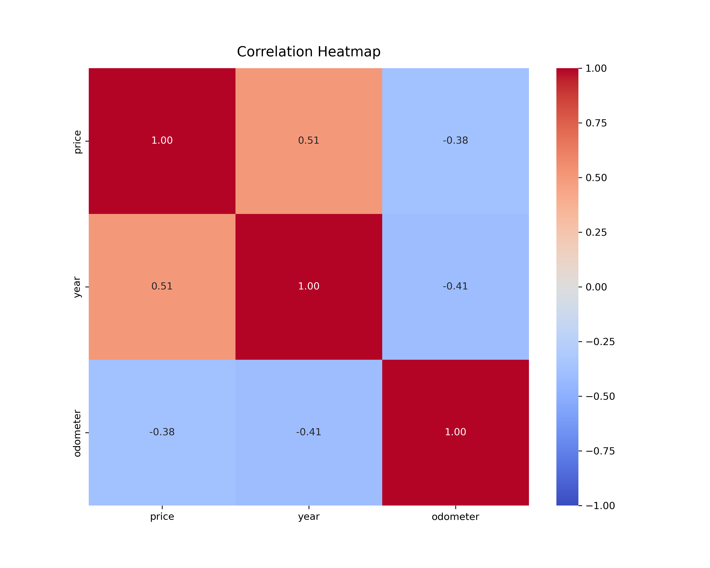

Some relationships are non-linear, suggesting limitations of basic linear models.

Multiple charts were used during this stage, including:

Price distribution histograms

Scatter plots (year vs. price, mileage vs. price)

Correlation bar charts for numeric features

4. Modeling Approach — Multiple Linear Regression Rounds

Rather than relying on a single model, five rounds of linear regression were performed, each with different feature sets or preprocessing strategies.

Regression Rounds
Model Round	Description
Model 1	Baseline Linear Regression with basic features
Model 2	Linear Regression with two strongest features - Year and Odometer only 
Model 3	With Strong influencing and higest data count
Model 4	With Features that has more data
Model 5	With additional features

This approach allowed comparison of how feature inclusion and preprocessing choices affect model performance.

5. Model Performance Comparison

Models were evaluated using MSE and checked for accuracy:

Utilized various visualizations to compare the model prediction vs actual data

| Model Name | Accuracy |
|----------|---------|
| Model 1 - Baseine | 67.6 |
| Model 2 - Limited features | 14.63 |
| Model 3 – Custom columns | 50.45 |
| Model 4  - More stronger features  | 66.25 |
| Model 5 - All stronger features |  67.99 |

Performance Summary
Model Complexity ↑  →  Prediction Accuracy ↑
Baseline models provided interpretability
Enhanced models improved explanatory power

Results from different Models with a **2020 new condition, gas awd, 150000 mileage**

| Model Name |Prediction |
|----------|---------|
| Model 1 | 17832.55 |
| Model 2 | 13817.44 |
| Model 3 | 34127.28 |
| Model 4 | 47102.20 |
| Model 5 | 29486.36 |

 ### LR Model 1

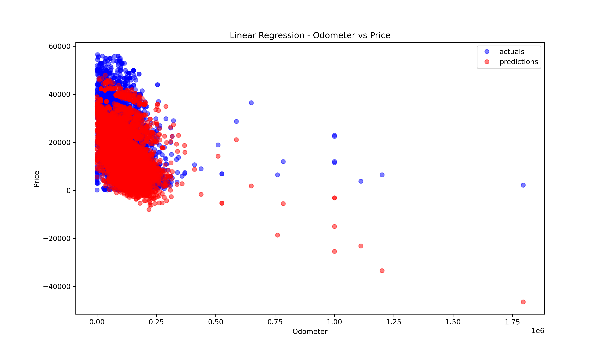

 ### LR Model 2
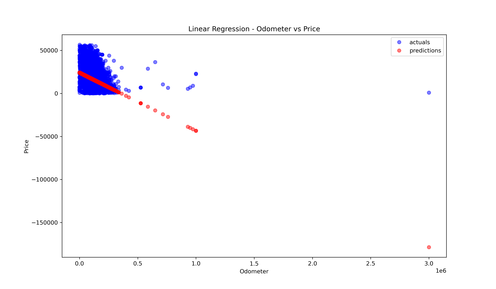

 ### LR Model 3
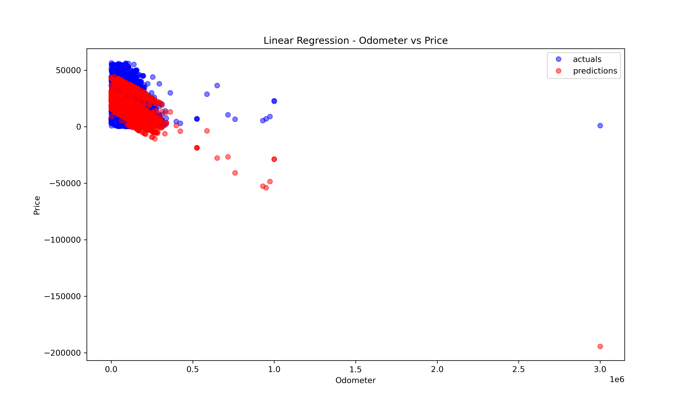

 ### LR Model 4
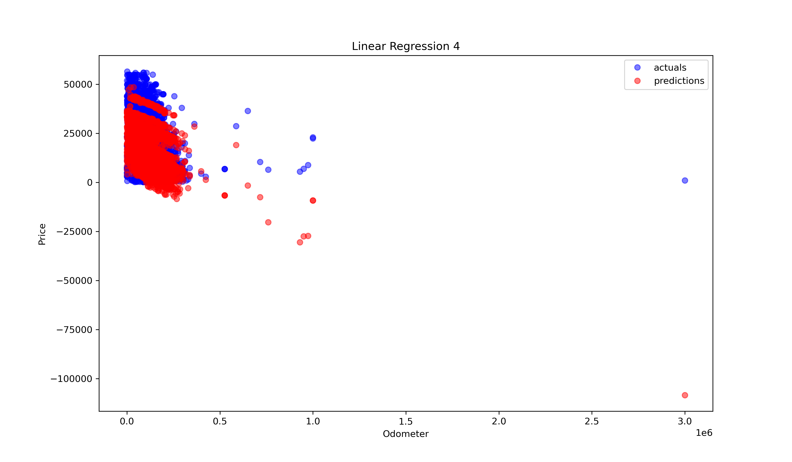

 ### LR Model 5
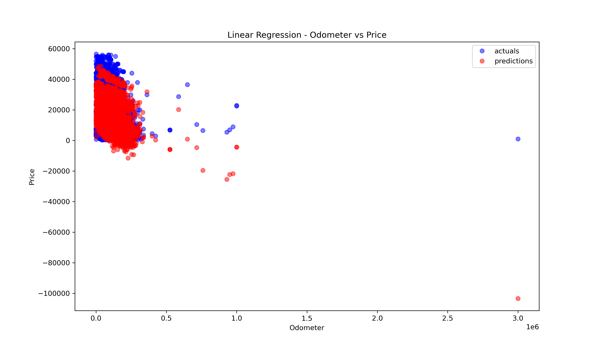

Key observations:

Adding categorical features significantly improved performance.

Scaling improved coefficient stability but did not drastically change accuracy.

Regularization helped control feature dominance in high-dimensional models.

6. Key Insights for the Dealership

Based on the regression results:

Vehicle year is one of the strongest positive predictors of price. But it cannot accurately predit the price as there are multiple factors that can positively or negatively influence the price. 

Mileage consistently reduces price, even after controlling for other variables.

Brand and fuel type have meaningful price effects.

Transmission type and engine size also contribute but with smaller impact.

These insights can help dealerships:

Avoid overpaying for high-mileage inventory

Better price newer vehicles

Highlight valuable features in marketing and sales discussions

7. Limitations & Next Steps
Limitations

Linear models cannot fully capture non-linear pricing behavior.

Market and regional pricing effects were not included.

No temporal pricing trends were modeled.

Next Steps

Introduce non-linear models (Random Forest, Gradient Boosting)

Perform feature importance analysis

Incorporate location and market demand indicators

Final Note

This analysis emphasizes interpretability and business insight, aligning model decisions with real-world dealership needs rather than focusing solely on prediction accuracy.s
